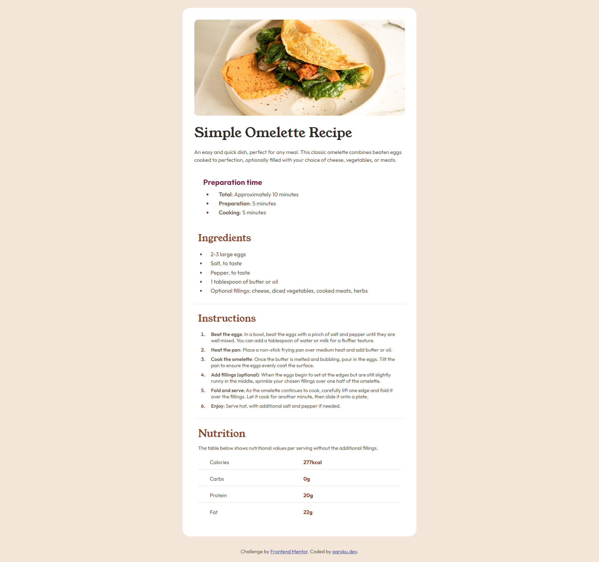

# Frontend Mentor - Recipe page solution

This is a solution to the [Recipe page challenge on Frontend Mentor](https://www.frontendmentor.io/challenges/recipe-page-KiTsR8QQKm). Frontend Mentor challenges help you improve your coding skills by building realistic projects. 

## Table of contents

- [Overview](#overview)
  - [The challenge](#the-challenge)
  - [Screenshot](#screenshot)
  - [Links](#links)
- [My process](#my-process)
  - [Built with](#built-with)
  - [What I learned](#what-i-learned)
  - [Continued development](#continued-development)
- [Author](#author)

## Overview

### Screenshot

### At desktop view

### At mobile view

### Links

- Solution URL: [Solution URL](https://github.com/qqroku/Recipe-page)
- Live Site URL: [Live site URL](https://qqroku.github.io/Recipe-page/)

## My process

### Built with

- Semantic HTML5 markup
- CSS custom properties
- Flexbox
- CSS Grid
- Mobile-first workflow

### What I learned

I've learned some css grid styles

### Continued development

responsive layouts

## Author

- Github - [qqroku](https://github.com/qqroku)
- Frontend Mentor - [@qqroku](https://www.frontendmentor.io/profile/qqroku)